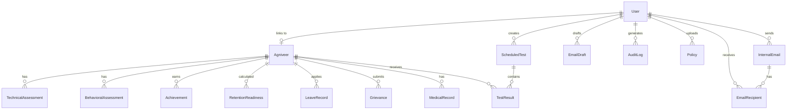

# KAUSHAL-SETU Database Schema Documentation

## Overview

The database consists of **15 tables** organized into 6 functional modules, using PostgreSQL with SQLAlchemy ORM.



---

## Module 1: User Management

### `users_auth`
Central authentication table for all system users.

| Column | Type | Constraints | Description |
|--------|------|-------------|-------------|
| `user_id` | Integer | PK, Auto | Unique identifier |
| `username` | String | UNIQUE, NOT NULL | Service ID (e.g., "IC-12345") or "admin" |
| `password_hash` | String | NOT NULL | Bcrypt hashed password |
| `role` | Enum | NOT NULL | One of: `agniveer`, `trg_officer`, `coy_cdr`, `coy_clk`, `co`, `admin` |
| `agniveer_id` | Integer | FK → agniveers.id | Links to Agniveer profile (nullable for officers) |
| `full_name` | String | | Display name for officers |
| `rank` | String | | Military rank (e.g., "Major", "Captain") |
| `assigned_company` | String | | Company assignment for access control |

**Relationships:**
- `agniveer` → One-to-One with `Agniveer` table

---

## Module 2: Agniveer Profile

### `agniveers`
Core profile table for all Agniveer soldiers.

| Column | Type | Description |
|--------|------|-------------|
| `id` | Integer | Primary key |
| `service_id` | String | Unique military service ID |
| `name` | String | Full name |
| `batch_no` | String | Training batch (e.g., "Jan 2026") |
| `company` | String | Assigned company (e.g., "Alpha Coy") |
| `unit` | String | Parent unit/regiment |
| `rank` | String | Current rank |
| `dob`, `joining_date`, `reporting_date` | DateTime | Key dates |
| `email`, `phone` | String | Contact info |
| `nok_name`, `nok_phone` | String | Next of kin |
| `hometown_address` | String | Permanent address |
| `bank_name`, `bank_branch`, `bank_account` | String | Financial details |
| `pan_card`, `adhaar_card` | String | Government IDs |
| `photo_url` | String | Profile picture path |
| `higher_qualification` | String | Education level |

**Relationships (One-to-Many):**
- `technical_assessments`, `behavioral_assessments`, `achievements`
- `leaves`, `grievances`, `medical_records`, `rri_calculations`

---

## Module 3: Assessment System

### `technical_assessments`
Stores military skill scores (contributes 40% to RRI).

| Column | Type | Weight | Description |
|--------|------|--------|-------------|
| `firing_score` | Float | 25% | Marksmanship |
| `weapon_handling_score` | Float | 20% | Weapon maintenance |
| `tactical_score` | Float | 30% | Field tactics |
| `cognitive_score` | Float | 25% | Mental tests |

**FK:** `agniveer_id` → `agniveers.id`

---

### `behavioral_assessments`
Quarterly behavioral evaluations (contributes 35% to RRI).

| Column | Type | Weight |
|--------|------|--------|
| `initiative` | Float | 20% |
| `dedication` | Float | 20% |
| `team_spirit` | Float | 18% |
| `courage` | Float | 18% |
| `motivation` | Float | 12% |
| `adaptability` | Float | 12% |
| `communication` | Float | Tracked only |
| `quarter` | String | e.g., "2025-Q1" |

---

### `achievements`
Awards and recognitions (contributes 25% to RRI).

| Column | Type | Description |
|--------|------|-------------|
| `title` | String | Achievement name |
| `type` | Enum | `SPORTS`, `TECHNICAL`, `LEADERSHIP`, `BRAVERY`, `INNOVATION`, `TRAINING`, `DISCIPLINARY` |
| `points` | Float | Point value (1-20 scale) |
| `date_earned` | DateTime | When awarded |
| `validity_months` | Integer | Default 24 months |

---

## Module 4: RRI Engine

### `retention_readiness`
Calculated Retention Readiness Index scores.

| Column | Type | Description |
|--------|------|-------------|
| `rri_score` | Float | Final score (0-100) |
| `retention_band` | Enum | `GREEN` (≥70), `AMBER` (50-69), `RED` (<50) |
| `technical_component` | Float | Weighted technical score |
| `behavioral_component` | Float | Weighted behavioral score |
| `achievement_component` | Float | Weighted achievement score |
| `technical_completeness` | Float | Data quality % |
| `behavioral_completeness` | Float | Data quality % |
| `overall_data_quality` | Float | Combined quality metric |
| `audit_notes` | String | Calculation log |

**Formula:**
```
RRI = (Technical × 0.40) + (Behavioral × 0.35) + (Achievements × 0.25)
```

---

## Module 5: Internal Communications

### `internal_emails`
Encrypted internal messaging system.

| Column | Type | Description |
|--------|------|-------------|
| `sender_id` | Integer | FK → users_auth |
| `subject`, `body` | String | Message content |
| `priority` | String | `Normal`, `High`, `Urgent` |
| `is_encrypted` | Boolean | End-to-end encryption flag |
| `is_deleted_by_sender` | Boolean | Soft delete |

### `email_recipients`
Junction table for message delivery.

| Column | Type | Description |
|--------|------|-------------|
| `email_id` | Integer | FK → internal_emails |
| `recipient_id` | Integer | FK → users_auth |
| `is_read` | Boolean | Read status |
| `folder` | String | `inbox`, `trash`, `archived` |
| `is_starred` | Boolean | Flagged |

### `email_drafts`
Unsent message storage.

---

## Module 6: HR Management

### `leave_records`
Leave application tracking.

| Column | Type | Values |
|--------|------|--------|
| `leave_type` | String | `CASUAL`, `MEDICAL`, `SPECIAL` |
| `status` | Enum | `PENDING`, `APPROVED`, `REJECTED` |
| `start_date`, `end_date` | DateTime | Leave period |

### `grievances`
Complaint management system.

| Column | Type | Values |
|--------|------|--------|
| `type` | String | `ADMIN`, `MEDICAL`, `PERSONAL` |
| `addressed_to` | String | `CO`, `COMMANDER` |
| `status` | Enum | `PENDING`, `IN_REVIEW`, `RESOLVED` |

### `medical_records`
Health tracking with SHAPE categories.

| Category | Description |
|----------|-------------|
| SHAPE 1 | Fit for all duties |
| SHAPE 2 | Temporary restriction |
| SHAPE 3 | Permanent light duty |
| SHAPE 4 | Unfit for field |
| SHAPE 5 | Medical discharge |

---

## Module 7: Training Officer

### `scheduled_tests`
Training and assessment scheduling.

| Column | Type | Description |
|--------|------|-------------|
| `name` | String | Test name (e.g., "BPET Q1") |
| `test_type` | Enum | `PFT`, `FIRING`, `WEAPONS`, `TACTICAL`, `COGNITIVE`, `CLASSROOM`, `CUSTOM` |
| `target_type` | String | `ALL`, `BATCH`, `COMPANY` |
| `target_value` | String | Specific batch/company name |
| `max_marks`, `passing_marks` | Float | Scoring criteria |
| `status` | String | `SCHEDULED`, `IN_PROGRESS`, `COMPLETED`, `CANCELLED` |

### `test_results`
Individual test scores.

| Column | Type | Description |
|--------|------|-------------|
| `test_id` | Integer | FK → scheduled_tests |
| `agniveer_id` | Integer | FK → agniveers |
| `score` | Float | Marks obtained |
| `is_absent` | Boolean | Attendance flag |

---

## Dependency Graph

```
users_auth (root)
├── agniveers (1:1)
│   ├── technical_assessments (1:N)
│   ├── behavioral_assessments (1:N)
│   ├── achievements (1:N)
│   ├── retention_readiness (1:N)
│   ├── leave_records (1:N)
│   ├── grievances (1:N)
│   ├── medical_records (1:N)
│   └── test_results (1:N)
├── internal_emails (1:N)
│   └── email_recipients (1:N)
├── email_drafts (1:N)
├── policies (1:N)
├── audit_logs (1:N)
├── rate_limit_logs (1:N)
└── scheduled_tests (1:N)
    └── test_results (1:N)
```

---

## Key Enums

| Enum | Values |
|------|--------|
| `UserRole` | `agniveer`, `trg_officer`, `coy_cdr`, `coy_clk`, `co`, `admin` |
| `RRIBand` | `GREEN`, `AMBER`, `RED` |
| `AchievementType` | `SPORTS`, `TECHNICAL`, `LEADERSHIP`, `BRAVERY`, `INNOVATION`, `TRAINING`, `DISCIPLINARY` |
| `LeaveStatus` | `PENDING`, `APPROVED`, `REJECTED` |
| `GrievanceStatus` | `PENDING`, `IN_REVIEW`, `RESOLVED` |
| `MedicalCategory` | `SHAPE 1` through `SHAPE 5` |
| `TestType` | `PFT`, `FIRING`, `WEAPONS`, `TACTICAL`, `COGNITIVE`, `CLASSROOM`, `CUSTOM` |
